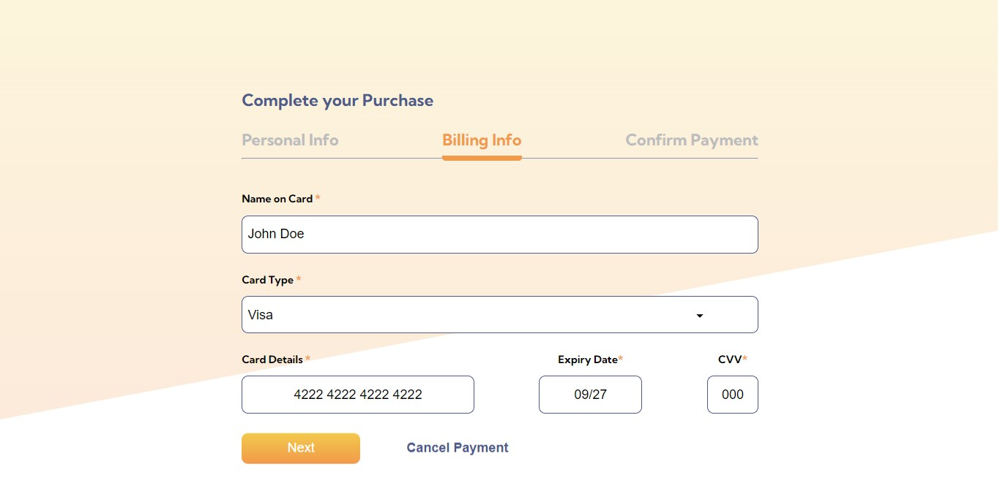
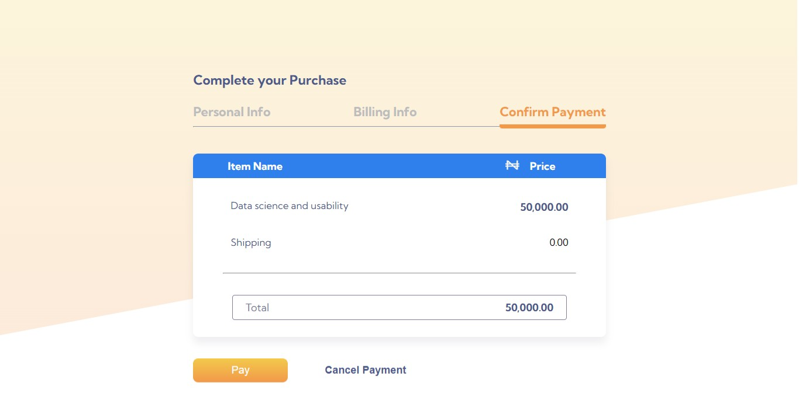

# Payment Flow - Sofware Engineer Task 1

This is a solution to the [FIRST TASK(TASK 1)](https://docs.google.com/document/d/1R1tnvH2jkCFF1XHqzBLoE9D6ylUgCcdSVJom2gl5d1A/edit) for the Software Engineer Test Questions for Frontend.

## Table of contents

- [Payment Flow - Sofware Engineer Task 1](#payment-flow---sofware-engineer-task-1)
  - [Table of contents](#table-of-contents)
  - [Overview](#overview)
    - [The challenge](#the-challenge)
    - [Screenshot](#screenshot)
    - [Links](#links)
  - [My process](#my-process)
    - [Built with](#built-with)
    - [Continued development](#continued-development)
    - [Useful resources](#useful-resources)
  - [Author](#author)

## Overview

### The challenge

Candidates should implement the design flow in the [link](<​​https://www.figma.com/file/Cz5bFXR6FuYl1N0YcGxwvJ/Frontend-Dev-Task-(Payment-Flow)?node-id=0%3A1>) with React JS.

### Screenshot

### Links

- Solution URL: [My Solution](https://github.com/Multimarix/payment-flow)
- Live Site URL: [Live Site Demo](https://payment-flow-task.netlify.app/)

## My process

### Built with

- Semantic HTML5 markup
- CSS custom properties
- Flexbox
- CSS Grid
- [React](https://reactjs.org/) - JS library
- [Styled Components](https://styled-components.com/) - For styles

### Continued development

Use this section to outline areas that you want to continue focusing on in future projects. These could be concepts you're still not completely comfortable with or techniques you found useful that you want to refine and perfect.

**Note: Delete this note and the content within this section and replace with your own plans for continued development.**

### Useful resources

- [OverAPI(Cheatsheets)](https://overapi.com/) - This help me look up methods and functions and what they do quickly.

## Author

- Github - [DEE](https://www.your-site.com)
- Frontend Mentor - [@Multimarix](https://www.frontendmentor.io/profile/Multimarix)
- LinkedIn - [Don AKhirebhulu](https://www.linkedin.com/in/don-akhirebhulu-675082242/)
